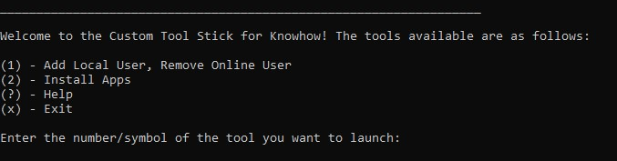

# Custom Toolz for Knowhow
### Version: 0.1

## About
A collection of custom batch files to speed up the workflow of staff working in retail IT support services. This includes tools to create a Windows 11 local admin account and remove a temporary online account used to set-up computers in Windows S Mode.
These tools are designed to be run from external storage device such as a USB thumbdrive on Windows 11 machines.

Created to ease frustrations with the time consuming and tedious proccesses at work. Added potential benefit of allowing less knowledgeable staff to complete more advanced tasks.

> Note: due to file size restrictions the app installers have not been included in this repo.
## How to use
1. Plug this USB stick into the target computer and run the 'RUNTOOLZ' file.
2. Accept the prompt to run as Administrator.
3. Follow the on-screen instructions

## Tool decriptions
### Add local user, Remove Online User
Used when a computer has to be initially set up using an online account (for S Mode). This tool will create a new admin user and remove the old 'online account' from the device. During
this process the computer will restart.
### Install Apps
Allows faster installation of common software such as Google Chrome, Firefox and Office 365. Subscriptions/accounts still need to be created/activated in the browser.
> App installers have not been included in this repo
